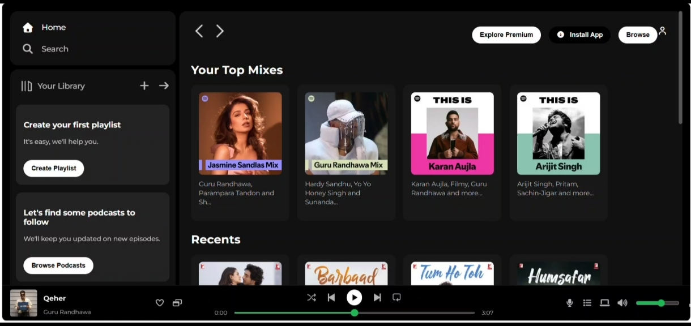

# 🎵 Spotify Clone

A responsive **Spotify-inspired music player interface** built using **HTML5** and **CSS3**. This project recreates the look and feel of Spotify's web player with a modern UI, responsive design, and intuitive navigation.

---

## 📌 Overview

The Spotify Clone is a frontend project that focuses on building a visually appealing and responsive music streaming interface. It demonstrates clean HTML structure, modern CSS styling, and responsive layouts inspired by Spotify.

---

## ✨ Features

- 🎧 Responsive Spotify-inspired UI
- 📂 Sidebar Navigation Menu
- 🔍 Search and Browse Sections
- 📚 Library and Playlist Section
- 🎵 Recently Played Albums
- 🌍 Featured Charts
- ▶️ Music Player Controls
- 📱 Mobile-Friendly Layout
- 🎨 Modern User Interface
- ✨ Smooth Hover Effects

---

## 🛠️ Technologies Used

- HTML5
- CSS3
- Google Fonts
- Font Awesome

---

## 📂 Project Structure

```text
spotify-clone/
│── assets/
│   └── preview.jpeg
│── index.html
│── style.css
│── README.md
```

---

## 📸 Preview



---

## 📚 Learning Outcomes

Through this project, I improved my understanding of:

- Responsive Web Design
- CSS Flexbox
- Layout Design
- Navigation Components
- Music Player UI Design
- CSS Positioning
- Hover Effects & Transitions
- Writing Clean and Structured Code

---

## 🚀 Future Enhancements

- Add JavaScript functionality
- Implement Play/Pause Controls
- Add Progress Bar Functionality
- Integrate Music Streaming API
- Add Dark/Light Theme Toggle
- Improve Accessibility (ARIA Support)

---

## 👩‍💻 Author

**Bhumika Srivastava**

- GitHub: https://github.com/bhumika77-ui

---

⭐ If you found this project helpful, consider giving it a **Star** on GitHub!